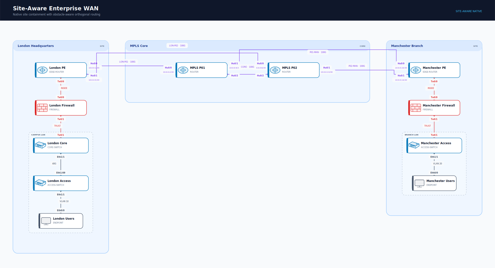
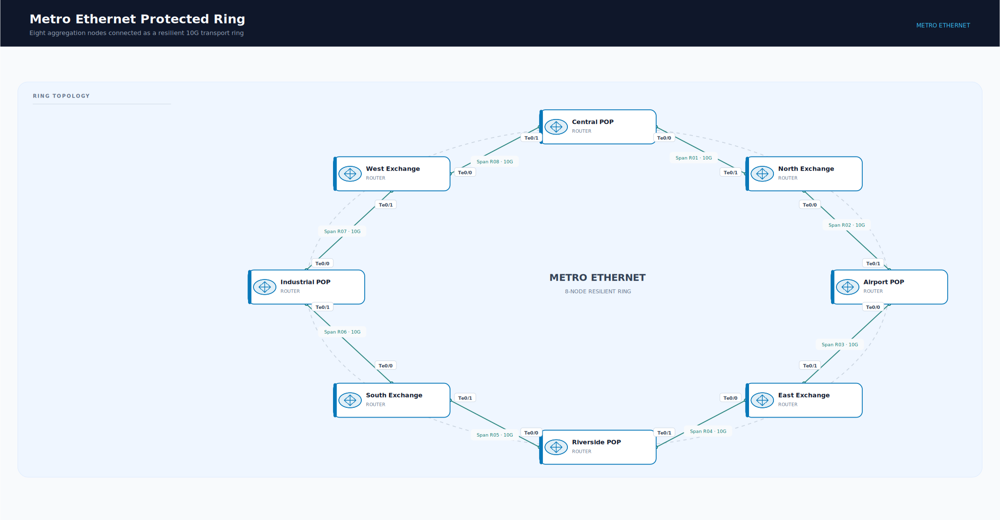
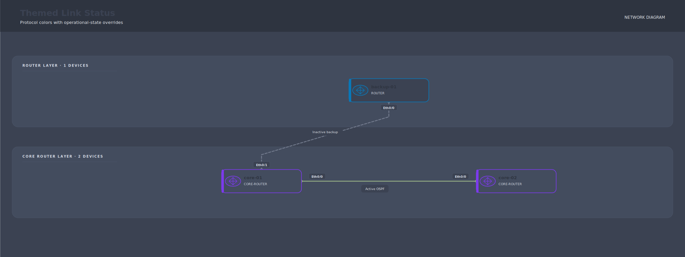
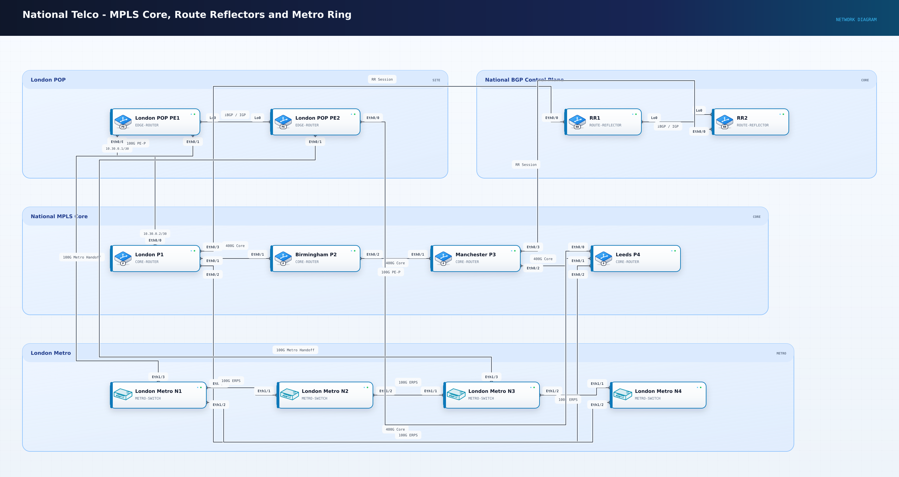

# Network Diagram Builder

[](https://github.com/gwoodwa1/netdiag/actions/workflows/ci.yml)
[](go.mod)
[](LICENSE)

This repository contains an early modern, YAML-driven network diagram builder
inspired by [cidrblock/drawthe.net](https://github.com/cidrblock/drawthe.net).

The first working slice renders deterministic spine-leaf SVG diagrams with
source interface labels, central link labels, and target interface labels.

## Quick start

```sh
go run ./cmd/netdiag validate examples/spine-leaf.yaml
go run ./cmd/netdiag render examples/spine-leaf.yaml
```

The render command creates `examples/spine-leaf.svg`.

Build a standalone CLI:

```sh
go build -o netdiag ./cmd/netdiag
./netdiag render examples/spine-leaf.yaml
```

Try it in Docker with no local Go installation:

```sh
docker build -t netdiag . && docker run --rm -v "$PWD:/work" -w /work netdiag render examples/templates/national-telco-template.yaml -o /work/national-telco.png
```

## Playground

Open the dependency-free [netdiag playground](docs/playground.html) to explore
a site-aware diagram with pan, zoom, element inspection, and collapsible
groups. It is generated entirely by netdiag and works without a server.

## Rendered gallery

| Site-aware WAN | Metro Ethernet ring |
| --- | --- |
| [](examples/16-site-aware-wan.svg) | [](examples/14-metro-ethernet-ring.svg) |
| **Nord status styling** | **Premium telco composition** |
| [](examples/17-themed-link-status.svg) | [](examples/templates/national-telco-premium.png) |

See the [full example gallery](docs/gallery.md) for routing protocols, campus,
cloud, security, data-center, and service-provider topologies.

## CLI workflow

```sh
netdiag schema > netdiag.schema.json
netdiag validate --json examples/spine-leaf.yaml
netdiag expand examples/templates/mpls-wan-template.yaml -o expanded.yaml
netdiag validate examples/includes/mpls-wan.yaml
netdiag templates
netdiag icons
netdiag render examples/custom-icon-pack.yaml --icons examples/custom-icons -o custom-icons.svg
netdiag fmt -w examples/spine-leaf.yaml
netdiag capabilities
netdiag recommend examples/spine-leaf.yaml
netdiag lldp show-lldp-neighbors-detail.txt --local leaf-01 -o discovered.yaml
netdiag lldp lldp-captures/ -o discovered-network.yaml
netdiag plan --renderer d2 examples/spine-leaf.yaml
netdiag render examples/spine-leaf.yaml -o examples/spine-leaf.svg
netdiag render examples/spine-leaf.yaml -o examples/spine-leaf.html
netdiag render examples/spine-leaf.yaml -o examples/spine-leaf.png
netdiag render examples/spine-leaf.yaml -o examples/spine-leaf.pdf
```

When no renderer is selected, `netdiag render` recommends and selects one from
the diagram's requirements. CLI `--renderer` takes precedence over
`diagram.renderer`, which takes precedence over automatic recommendation.
Use `--report` to persist the capability assessment and warnings:

```sh
netdiag render examples/skills/d2-elk-hard-cases.yaml --renderer d2 --layout elk \
  --report render-report.json -o examples/skills/d2-elk-hard-cases.elk.svg
```

The output extension selects SVG, interactive HTML, PNG, or PDF. HTML embeds
the native SVG with offline pan, zoom, inspection, and group-collapse controls.
PNG and PDF use a locally installed converter. See
[docs/export.md](docs/export.md) and [docs/interactive.md](docs/interactive.md).
LLDP discovery output from OpenConfig JSON, Cisco, Juniper, and Arista can be
converted into diagram YAML; see [docs/lldp.md](docs/lldp.md).

D2 is used as an automatic-layout experiment, not assumed to solve every
network-diagram requirement. See [docs/d2-elk-spike.md](docs/d2-elk-spike.md)
for the hard-case results and [SKILLS.md](SKILLS.md) for the LLM repair loop.

## Architecture

Authored YAML is resolved and expanded into `spec.Document`, then validated and
compiled into the renderer-neutral `model.Diagram` intermediate
representation. Native SVG, D2, planning, and recommendation code consume that
IR rather than parsing source YAML. Renderer support is advertised through the
planner's `RendererCapability` contract, keeping recommendation logic separate
from backend implementation details.

## Template blocks

Reusable template blocks compose larger telco-style diagrams while keeping the
renderers simple. A diagram's `use` entries instantiate templates from
`templates/`, and `connect` adds links after expansion:

```yaml
use:
  - template: site.dual-pe
    as: london
    params:
      site_label: London

connect:
  - from: london-pe1:Ethernet0/0
    to: uk-core-p1:Ethernet0/0
    label: 100G
```

Render template diagrams directly, or inspect their normal canonical form:

```sh
netdiag render examples/templates/mpls-wan-template.yaml -o mpls-wan.svg
netdiag expand examples/templates/mpls-wan-template.yaml -o expanded.yaml
```

See [docs/templates.md](docs/templates.md) for the template format, naming
rules, parameters, and Phase 1 limitations.

The native renderer's deterministic offline icon catalog is available through
`netdiag icons` and `netdiag icons --json`. See [docs/icons.md](docs/icons.md).
Replace built-ins with a local SVG pack using `render --icons <directory>` or
`NETDIAG_ICONS`; missing or unsafe files fall back to the built-in catalog.
Use `diagram.theme: premium` for opt-in gradients, layered device cards,
status LEDs, cable underlays, and a subtle technical-grid background.
Use `diagram.theme: nord` or `diagram.theme: dracula` for a global dark color
scheme. Protocol and operational-state link rules can be declared once and
reused across links; status rules override protocol rules field-by-field:

```yaml
diagram:
  theme: nord
  link_styles:
    protocol:
      ospf: {color: "#a3be8c", pattern: solid, width: 3}
    status:
      inactive: {color: "#7b8496", pattern: dashed}

links:
  - from: core-01:Ethernet0/0
    to: core-02:Ethernet0/0
    protocol: ospf
    status: active
  - from: core-01:Ethernet0/1
    to: backup-01:Ethernet0/0
    protocol: ospf
    status: inactive
```

## Explicit includes

Split larger projects into normal YAML fragments with top-level `include`.
Paths resolve relative to the containing file, and included fragments may
instantiate templates:

```yaml
version: 1
include:
  - parts/sites.yaml
  - parts/core.yaml

diagram: {title: UK MPLS WAN, layout: sites}
connect:
  - from: london-pe1:Ethernet0/0
    to: uk-core-p1:Ethernet0/0
    label: 100G
```

Includes merge deterministically before template expansion. Duplicate IDs,
cycles, absolute paths, and paths escaping the entry diagram's directory are
rejected. See [docs/includes.md](docs/includes.md) for the full contract.

```yaml
links:
  - from:
      node: spine-01
      port: Ethernet1/1
      address: 10.10.10.1/30
    to:
      node: leaf-01
      port: Ethernet1/49
      address: 10.10.10.2/30
    labels:
      source: Eth1/1
      middle: 100G DWDM CKT-1001
      target: Eth1/49
```

Scalar endpoints and the legacy middle `label:` remain supported. Structured
endpoints add CIDR addresses and explicit source/middle/target labels without
forcing a heavier syntax on simple diagrams.

LACP bundles and VLAN trunks use structured link metadata:

```yaml
links:
  - from: leaf-01:Ethernet1/1
    to: app-01:Ethernet0/0
    label: 25G
    bundle: Port-Channel10
    lacp: true
    multi_chassis: true
    trunk:
      encapsulation: dot1q
      allowed_vlans: ["10", "20", "100-120"]
```

Physical bundle members remain visible. The topology uses compact bundle
markers such as `Po10`. Aggregate bandwidth, LACP, trunk encapsulation, and
allowed VLANs move into a fixed bundle-details legend in the left gutter so
adjacent bundles cannot create overlapping boxes.

Set `multi_chassis: true` when bundle members terminate on different switches.
The rendered caption then identifies the bundle as `MC-LAG · LACP`.

Full interface names remain in YAML, while rendered endpoint labels use common
network abbreviations. For example, `Ethernet0/0` renders as `Eth0/0`,
`GigabitEthernet0/1` as `Gi0/1`, and `TenGigabitEthernet1/1` as `Te1/1`.
Unknown long interface prefixes are shortened to five characters.

Nodes are automatically placed into rows based on their `role`. Within a row,
node IDs determine stable left-to-right placement. Add a small numeric `order`
to a node when topology meaning should control placement:

```yaml
nodes:
  west-router: {label: West Router, role: router, order: 10}
  core-router: {label: Core Router, role: router, order: 20}
  east-router: {label: East Router, role: router, order: 30}
```

Set `diagram.layout: ring` to arrange ordered nodes clockwise around a resilient
ring. The first node is placed at the top:

```yaml
diagram: {title: Metro Ring, layout: ring, link_style: direct}
nodes:
  ring-01: {label: Ring Node 01, role: router, order: 10}
  ring-02: {label: Ring Node 02, role: router, order: 20}
```

Set `diagram.layout: sites` to make top-level groups into native site
containers. Devices are arranged into stable role rows inside each site,
core/WAN groups are placed between sites, and nested groups render as
subordinate boundaries. Site layouts automatically use deterministic,
obstacle-aware orthogonal routing:

```yaml
diagram: {title: Enterprise WAN, layout: sites, link_style: orthogonal}
groups:
  london:
    label: London
    kind: site
    nodes: {london-pe: {}}
  mpls-core:
    label: MPLS Core
    kind: core
    nodes: {p-01: {}}
```

See `examples/16-site-aware-wan.yaml` for a complete multi-site example.

The default `clean` link style uses aligned vertical port lead-ins before
crossing between layers. Bundled members converge through a compact circular
port-channel marker, keeping trunk metadata separate from physical interface
labels.

Device cards include deterministic, original isometric SVG role icons inspired
by familiar network-stencil conventions. Spine switches use a multilayer
fabric-switch chassis, while leaf switches use a low-profile access-switch
chassis with a visible port bank.

Layer headings occupy a dedicated left gutter outside the topology placement
area. Links and devices cannot enter that gutter, so headings never mask or
overlap diagram geometry.

See [docs/gallery.md](docs/gallery.md) for seventeen additional rendered
examples covering WAN, DWDM, campus LAN, firewalls, wireless, SD-WAN, OT, AWS,
OSPF, IS-IS, BGP route reflection, Metro Ethernet rings, and MPLS metro
networks, including native site-aware containment and orthogonal routing.
