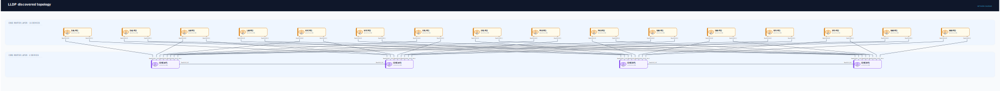
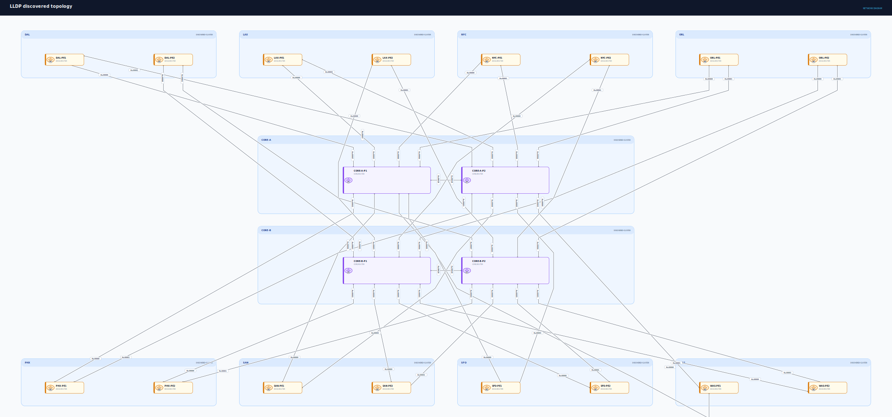

# Round-trip workflow

Netdiag does not try to make auto-layout perfect; it makes manual layout
repeatable.

The Draw.io workflow keeps each responsibility explicit:

```text
topology YAML        = network truth
Draw.io              = editable visual artefact
layout override YAML = durable human layout intent
SVG/PNG/PDF          = publication output
```

## Worked example

The files in [`examples/round-trip`](../examples/round-trip/) show a complete,
reproducible topology evolution:

- [`topology-v1.yaml`](../examples/round-trip/topology-v1.yaml) defines the
  initial topology.
- [`topology-v1.layout.yaml`](../examples/round-trip/topology-v1.layout.yaml)
  captures the polished positions and routes.
- [`topology-v1.drawio`](../examples/round-trip/topology-v1.drawio) is the
  editable v1 artefact.
- [`topology-v2.yaml`](../examples/round-trip/topology-v2.yaml) adds `edge-02`
  and its link.
- [`topology-v2.drawio`](../examples/round-trip/topology-v2.drawio) preserves
  v1 layout intent and deterministically places the new node near `core-b`.

```sh
# Generate an editable Draw.io file.
netdiag render examples/round-trip/topology-v1.yaml \
  --renderer drawio \
  --layout-overrides examples/round-trip/topology-v1.layout.yaml \
  -o examples/round-trip/topology-v1.drawio

# After editing, extract supported durable layout intent.
netdiag extract-overrides examples/round-trip/topology-v1.drawio \
  --source examples/round-trip/topology-v1.yaml \
  --report \
  -o examples/round-trip/topology-v1.layout.yaml

# Apply old polish to evolved topology and explain every layout decision.
netdiag render examples/round-trip/topology-v2.yaml \
  --renderer drawio \
  --layout-overrides examples/round-trip/topology-v1.layout.yaml \
  --layout-report \
  -o examples/round-trip/topology-v2.drawio
```

The final command reports:

```text
Preserved:
- 3 nodes
- 2 links

Auto-placed:
- node edge-02 near core-b

Auto-routed:
- core-b__edge-02
```

## IOS-XR discovery before and after

The same lifecycle matters more on a discovered topology. The raw LLDP capture
is complete but visually dense; the refined source preserves the network truth
while adding durable grouping, routing, and presentation intent.

| Raw LLDP discovery | Refined eight-site dual-plane topology |
| --- | --- |
| [](../examples/round-trip/iosxr-raw-discovery.svg) | [](../examples/discovery/lldp-iosxr-8-site-dual-plane.svg) |

Recreate the raw side directly from the committed captures:

```sh
netdiag discover lldp \
  examples/discovery/lldp-iosxr-8-site-dual-plane-captures \
  -o /tmp/lldp-iosxr-8-site-raw.yaml

netdiag render /tmp/lldp-iosxr-8-site-raw.yaml \
  -o examples/round-trip/iosxr-raw-discovery.svg
```

See [export.md](export.md) for the preservation contract, safe Draw.io edits,
strict extraction, and tolerant layout reporting.
